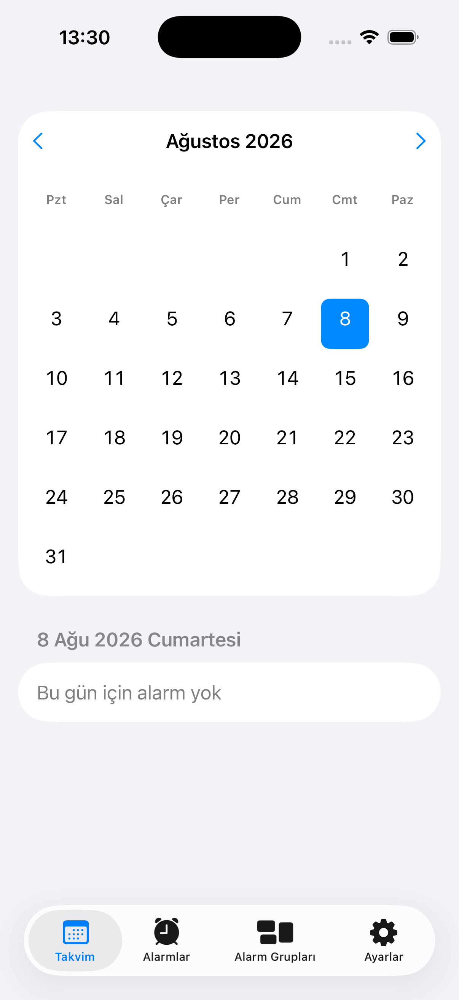
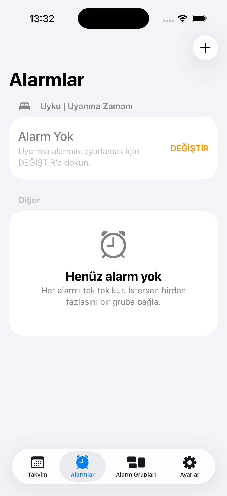
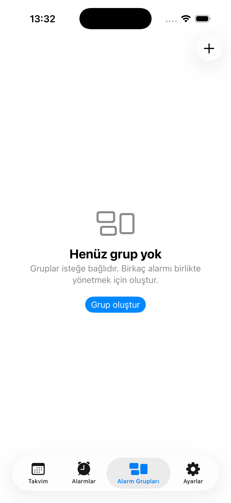
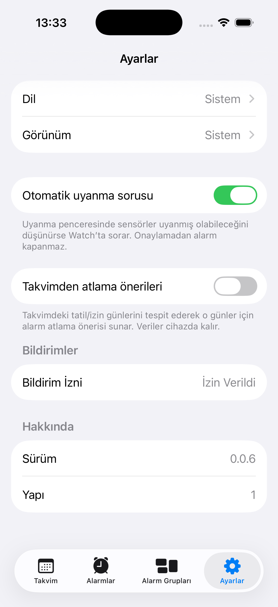

# AlarmApp

[](https://github.com/GktuOktay/AlarmApp/actions/workflows/ci.yml)
[](LICENSE)


**Alarmlarını grupla, uyandığında bilek seni anlasın, gerisini kapatsın.**

iPhone ve Apple Watch için yerel (local-first) bir alarm uygulaması. Sabah aralığına yayılmış alarmları gruplar; uyandığında Watch veya telefon üzerinden kalanları tek hareketle susturmanı sağlar.

## Ekran görüntüleri

| Takvim | Alarmlar | Alarm Grupları | Ayarlar |
|---|---|---|---|
|  |  |  |  |

## Öne çıkan özellikler

- **Alarm grupları** — sabaha yayılmış birden fazla alarmı bir grupta topla, biri çaldığında "Grup — bugün" ile kalanları tek dokunuşla iptal et
- **Takvimden ileri tarihli atlama (bypass)** — tatile çıkarken her sabah tek tek kapatmak yerine, o günleri önceden işaretle
- **Opt-in takvim önerisi** — sistem takviminden tatil/izin günlerini tespit edip atlama önerisi sunar, veriler cihazdan çıkmaz
- **Apple Watch'tan bağımsız çalışma** — telefon yakında olmasa bile bilekten alarm yönetimi
- **HealthKit tabanlı otomatik uyanma sorusu** (isteğe bağlı) — sensörler uyanmış olabileceğini düşünürse Watch'ta onay ister
- Tam **Dynamic Type**, **VoiceOver** ve **Azaltılmış Hareket** desteği; Türkçe dahil 7 dilde arayüz

Kullanım detayları için: [`KULLANIM.md`](KULLANIM.md)

## Gereksinimler

- Xcode 15 veya üzeri
- **iPhone 11 ve sonrası** (iOS 17+) / watchOS 10+
- Apple Developer hesabı (cihaz ve TestFlight için)

> SwiftData nedeniyle minimum OS iOS 17’dir. iPhone 11 bu sürümü çalıştırır; daha eski iOS sürümleri desteklenmez.
>
> **Model:** Alarm birincildir; grup isteğe bağlıdır.

```bash
git clone https://github.com/GktuOktay/AlarmApp.git
cd AlarmApp
chmod +x scripts/generate-xcode.sh
./scripts/generate-xcode.sh   # XcodeGen + Xcode gerekir
open AlarmApp.xcodeproj
```

Scheme: **AlarmApp-iOS** (Watch companion birlikte). Simülatör: iOS 26.5 / watchOS 26.5.

Çekirdek paket testleri:

```bash
cd AlarmAppCore && swift test
```

## Mimari (özet)

| Parça | Rol |
|---|---|
| `AlarmAppCore` | Paylaşılan domain, veri ve WatchConnectivity mantığı (SwiftUI yok) |
| `AlarmApp-iOS` | iPhone arayüzü (SwiftUI) |
| `AlarmApp-Watch` | Apple Watch arayüzü (SwiftUI) |

Ayrıntılar: [`docs/02-teknik-mimari.md`](docs/02-teknik-mimari.md)

## Dokümanlar

| Dosya | İçerik |
|---|---|
| [`docs/00-PRD-…`](docs/00-PRD-urun-gereksinim-dokumani.md) | Ürün gereksinimleri |
| [`docs/01-ux-…`](docs/01-ux-tasarim-ve-akislar.md) | UX ve akışlar |
| [`docs/02-teknik-…`](docs/02-teknik-mimari.md) | Teknik mimari |
| [`docs/03-veri-…`](docs/03-veri-modeli-ve-arayuzler.md) | Veri modeli |
| [`docs/04-yol-…`](docs/04-yol-haritasi-ve-sprintler.md) | Yol haritası |
| [`docs/05-test-…`](docs/05-test-qa-plani.md) | Test planı |
| [`docs/06-acik-…`](docs/06-acik-kaynak-governance.md) | Açık kaynak yönetimi |
| [`docs/07-detayli-…`](docs/07-detayli-ekran-ve-fonksiyon-spesifikasyonu.md) | Ekran spesifikasyonu |
| [`docs/09-referans-…`](docs/09-referans-kaynaklar.md) | Referans kaynaklar |

## Sürüm notları

Son kullanıcı notları: [`CHANGELOG.md`](CHANGELOG.md) · Güncel sürüm: [`VERSION`](VERSION)

## Lisans

[MIT](LICENSE) © 2026 Göktuğ Oktay

## Katkı

[`CONTRIBUTING.md`](CONTRIBUTING.md) dosyasına bak. Büyük değişikliklerden önce tartışma açman iyi olur. Hata bildirimi veya özellik isteği için issue şablonlarını kullanabilirsin.

## Davranış kuralları ve güvenlik

[`CODE_OF_CONDUCT.md`](CODE_OF_CONDUCT.md) · [`SECURITY.md`](SECURITY.md)
